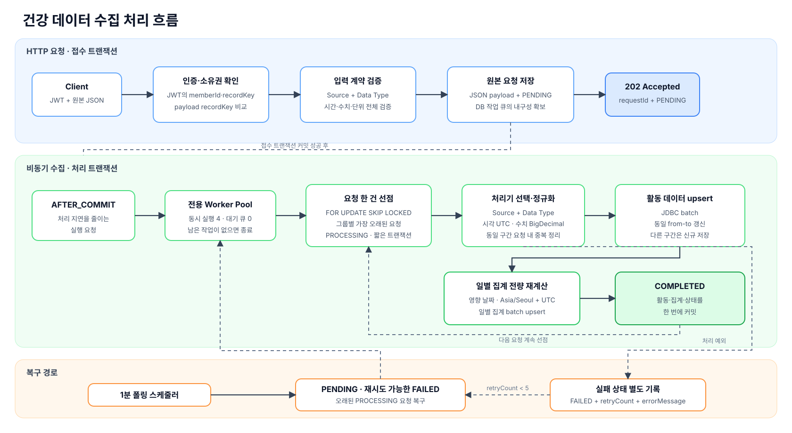
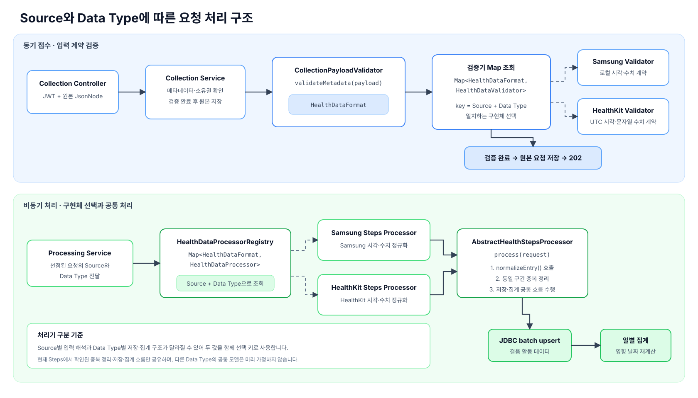
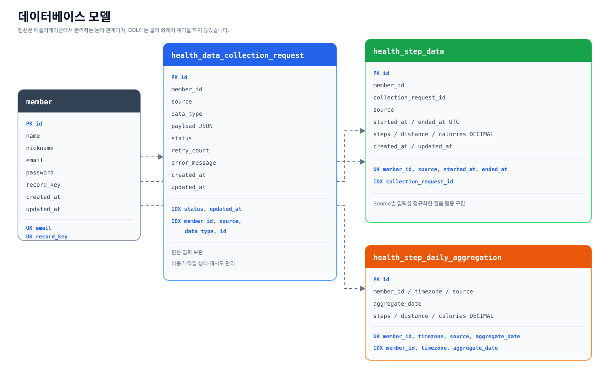

# Healthcare Data Collection Service

Samsung Health와 Apple HealthKit 활동 데이터를 정규화하여 저장하고, recordKey별 일·월 단위 집계를 제공하는 Spring Boot 기반 백엔드 서비스입니다.

건강 데이터 수집 요청은 원본을 안전하게 저장한 뒤 비동기로 처리합니다. 출처마다 다른 시간과 수치 표현을 UTC와 `BigDecimal` 기반으로 통일하고, 조회 시점에는 미리 계산된 일별 집계를 사용합니다.

## 목차

- [주요 기능](#주요-기능)
- [전체 처리 흐름](#전체-처리-흐름)
- [기술 스택](#기술-스택)
- [프로젝트 구조](#프로젝트-구조)
- [실행 방법](#실행-방법)
- [API 명세](#api-명세)
- [데이터베이스 설계](#데이터베이스-설계)
- [주요 설계 결정](#주요-설계-결정)
- [테스트](#테스트)
- [Daily/Monthly 조회 결과](#dailymonthly-조회-결과)
- [구현 중 발생한 문제와 해결](#구현-중-발생한-문제와-해결)
- [현재 한계와 확장 방향](#현재-한계와-확장-방향)
- [설계 문서](#설계-문서)

## 주요 기능

- 이름, 닉네임, 이메일과 비밀번호를 이용한 회원가입
- 이메일과 비밀번호를 이용한 로그인 및 JWT Access Token 발급
- 인증 사용자와 `recordKey`의 소유 관계 확인
- Samsung Health와 Apple HealthKit 걸음 데이터의 Source별 입력 검증
- 원본 JSON 저장 후 `202 Accepted`를 반환하는 비동기 수집 API
- 데이터베이스 작업 큐, 병렬 Worker와 폴링 스케줄러를 이용한 실패 복구
- Source별 시각과 수치 표현을 UTC와 `BigDecimal` 기반 데이터로 정규화
- 동일 활동 구간의 멱등 upsert와 수동 재처리 시 최신 데이터 보호
- `Asia/Seoul`, `UTC` 기준 일별 사전 집계
- `recordKey` 기준 일별·월별 집계 조회
- 수집 요청 상태 조회 및 수동 재처리

## 전체 처리 흐름



1. 수집 API는 JWT의 회원 식별값과 `recordKey`, Source, Data Type, 전체 활동 데이터 형식을 검증합니다.
2. 검증을 통과한 원본 JSON을 `PENDING` 상태로 저장하고 `202 Accepted`와 요청 식별값을 반환합니다.
3. 접수 트랜잭션이 커밋되면 `AFTER_COMMIT` 리스너가 Worker 실행을 요청합니다.
4. Worker는 MySQL에서 처리 가능한 요청을 선점하고 Source와 Data Type에 맞는 처리기를 선택합니다.
5. 처리기는 활동 시각을 UTC로, 측정값을 `BigDecimal`로 정규화한 뒤 걸음 활동 데이터를 JDBC batch로 upsert합니다.
6. 이번 요청이 영향을 준 일별 집계를 기존 활동 데이터 전체에서 다시 계산합니다.
7. 활동 데이터, 일별 집계와 요청의 `COMPLETED` 상태를 하나의 트랜잭션으로 커밋합니다.
8. 즉시 실행 요청이 유실되거나 처리에 실패한 경우 1분 폴링 스케줄러가 데이터베이스 상태를 기준으로 다시 처리합니다.

`202 Accepted`는 활동 데이터와 집계 처리가 끝났다는 의미가 아닙니다. 원본 요청이 유실되지 않고 다시 처리할 수 있는 상태로 접수됐다는 의미입니다.

### Source와 Data Type에 따른 처리기 선택



검증과 비동기 처리는 모두 `Source + Data Type` 조합을 키로 구현체를 선택합니다. Source마다 같은 필드의 시간과 수치 표현을 해석하는 방법이 다르고, Data Type마다 정규화 결과, 저장 구조와 집계 기준이 달라질 수 있기 때문입니다. 접수 단계에서는 `CollectionPayloadValidator`가 `HealthDataValidator` 구현체를 찾아 입력 계약을 검증하고, 비동기 단계에서는 `HealthDataProcessorRegistry`가 `HealthDataProcessor` 구현체를 찾아 해당 조합의 처리를 수행합니다.

현재 구현한 걸음 데이터 처리기는 Source마다 다른 입력 해석만 구체화하고, 실제로 동일하다고 확인된 동일 구간 중복 정리, JDBC batch upsert와 일별 집계 갱신은 `AbstractHealthStepsProcessor`의 공통 흐름을 사용합니다. 아직 제공되지 않은 Data Type까지 하나의 정규화 결과와 저장 흐름으로 미리 추상화하지 않았으며, 새로운 유형이 추가되면 해당 유형의 테이블과 처리기를 먼저 구체화한 뒤 반복되는 흐름이 확인될 때 공통화합니다.

## 기술 스택

| 구분 | 기술 | 사용 위치 |
| --- | --- | --- |
| Language | Java 17 | 애플리케이션 전체 |
| Framework | Spring Boot 4.1, Spring MVC | REST API와 애플리케이션 구성 |
| Persistence | Spring Data JPA, JDBC | 엔티티 조회·상태 관리, batch upsert와 집계 조회 |
| Database | MySQL 8.4 | 회원, 원본 요청, 활동 데이터와 집계 저장 |
| Security | Spring Security, OAuth2 Resource Server, BCrypt, JWT | 로그인, 비밀번호 해시와 Bearer 인증 |
| API 문서 | springdoc-openapi | Swagger UI와 OpenAPI 문서 |
| Test | JUnit 5, AssertJ, Mockito, Spring Boot Test | 단위·API·MySQL 연동·동시성 테스트 |
| Build/Local | Gradle, Docker Compose | 빌드와 로컬 MySQL 실행 |

## 프로젝트 구조

기능을 먼저 나누고, 기능 내부에서 현재 필요한 역할만 구분했습니다. 아직 필요가 확인되지 않은 포트·어댑터나 공통 계층은 미리 만들지 않았습니다.

```text
src/main/java/com/roberthj/project/healthcare
├── auth
│   ├── api              # 회원가입, 로그인, 인증 정보 API
│   ├── request/response # 인증 API 입출력
│   ├── security         # Security와 회원 데이터를 연결하는 인증 구성요소
│   └── service          # 회원가입과 로그인 사용 사례
├── member
│   ├── entity           # 회원 모델
│   ├── repository       # 회원 저장소
│   └── service          # 다른 기능에 제공하는 회원 조회 진입점
├── collection
│   ├── api              # 수집, 상태, 재처리와 집계 조회 API
│   ├── validator        # Source·Data Type별 입력 계약 검증
│   ├── processor        # Source별 정규화와 걸음 데이터 처리
│   ├── worker           # 즉시 실행 요청과 폴링 Worker
│   ├── aggregation      # 일별 집계 재계산
│   ├── repository       # JPA 조회와 JDBC batch 처리
│   ├── entity           # 원본 요청, 걸음 데이터와 일별 집계
│   └── service          # 접수·처리·조회·재처리 흐름
├── common               # 공통 엔티티 필드, 예외와 HTTP 응답
├── config               # Security, JWT, JPA와 비동기 실행 구성
└── system               # 헬스 체크 API
```

주요 리소스는 다음과 같습니다.

```text
src/main/resources
├── application.yml          # 공통 설정과 Worker·집계 정책
├── application-local.yml    # 로컬 MySQL과 JWT 설정
├── application-docker.yml   # 컨테이너 DB 연결과 스키마 검증 설정
└── db/schema.sql            # 최종 테이블 DDL

docs
├── images                   # 처리 흐름도, 구현체 선택 구조와 ERD
├── 초기-설계.md
└── 설계-변경-이력.md
```

## 실행 방법

### 사전 준비

- JDK 17
- Docker와 Docker Compose

저장소의 예시 환경변수를 복사합니다. `.env`는 Git에 포함되지 않으며, 실제 환경에서는 DB 비밀번호와 JWT Secret을 반드시 변경해야 합니다.

```bash
cp .env.example .env
```

### 로컬 MySQL 실행

```bash
docker compose up -d mysql
```

MySQL은 `.env.example`의 다음 기본값으로 실행됩니다.

| 항목 | 값 |
| --- | --- |
| Host | `localhost:3306` |
| Database | `healthcare` |
| Username | `healthcare` |
| Password | `healthcare` |

로컬 프로파일은 JPA `ddl-auto=update`를 사용하므로 애플리케이션 시작 시 필요한 테이블을 생성합니다. 최종 DDL은 [`schema.sql`](src/main/resources/db/schema.sql)에서도 확인할 수 있습니다.

### 애플리케이션 실행

```bash
./gradlew bootRun
```

기본 프로파일은 `local`이며, 실행 후 아래 주소를 사용할 수 있습니다.

- Swagger UI: `http://localhost:8080/swagger-ui/index.html`
- OpenAPI JSON: `http://localhost:8080/v3/api-docs`
- Health Check: `http://localhost:8080/health-check`

Swagger UI 우측 상단의 `Authorize`에 로그인 응답의 Access Token을 입력하면 보호된 API를 호출할 수 있습니다.

### Docker Compose 전체 실행

애플리케이션과 MySQL을 모두 컨테이너로 실행하려면 다음 명령을 사용합니다.

```bash
docker compose up --build -d
docker compose ps
```

애플리케이션 컨테이너는 `docker` 프로파일로 실행됩니다. MySQL 헬스 체크가 성공한 뒤 기동하며, `/health-check` 응답으로 애플리케이션 상태를 확인합니다.

빈 MySQL 볼륨에서는 [`schema.sql`](src/main/resources/db/schema.sql)이 최초 한 번 실행되고, 애플리케이션은 `ddl-auto=validate`로 엔티티와 테이블 구조의 일치 여부를 확인합니다. 이미 생성된 볼륨에는 초기화 스크립트가 다시 실행되지 않습니다.

```bash
curl http://localhost:8080/health-check
```

### 전체 테스트 실행

MySQL을 먼저 실행한 뒤 테스트합니다. JDBC upsert와 `FOR UPDATE SKIP LOCKED` 동작을 확인하기 위해 일부 테스트는 실제 MySQL을 사용합니다.

```bash
docker compose up -d mysql
./gradlew test
```

이전에 직접 저장한 로컬 데이터가 테스트와 충돌한다면 로컬 볼륨을 초기화한 뒤 다시 실행할 수 있습니다. 아래 명령은 이 Docker Compose 프로젝트의 로컬 데이터 볼륨을 삭제합니다.

```bash
docker compose down -v
docker compose up -d mysql
```

### 제공 입력 데이터로 수집 요청

제공 입력 파일은 저장소에 포함하지 않습니다. 로컬 `data/` 아래에 파일을 두고, JSON의 `recordkey`를 회원가입 응답으로 받은 값에 맞춘 뒤 호출합니다. `/data/`와 `INPUT_DATA*.json`은 `.gitignore`에 포함되어 있습니다.

```bash
curl -X POST 'http://localhost:8080/api/health-data/collections' \
  -H 'Authorization: Bearer <access-token>' \
  -H 'Content-Type: application/json' \
  --data-binary '@data/INPUT_DATA1.json'
```

## API 명세

### API 목록

| Method | Path | 인증 | 설명 | 성공 상태 |
| --- | --- | --- | --- | --- |
| `GET` | `/health-check` | 불필요 | 애플리케이션 상태 확인 | `200` |
| `POST` | `/api/auth/sign-up` | 불필요 | 회원가입 | `201` |
| `POST` | `/api/auth/sign-in` | 불필요 | 로그인과 Access Token 발급 | `200` |
| `GET` | `/api/auth/me` | 필요 | JWT의 회원 식별값과 `recordKey` 확인 | `200` |
| `POST` | `/api/health-data/collections` | 필요 | 건강 데이터 수집 요청 | `202` |
| `GET` | `/api/admin/health-data/collections/{requestId}` | 필요 | 수집 요청 상태 조회 | `200` |
| `POST` | `/api/admin/health-data/collections/{requestId}/reprocess` | 필요 | 지정 요청 수동 재처리 | `202` |
| `GET` | `/api/health-data/steps/daily` | 필요 | 일별 걸음 활동 집계 | `200` |
| `GET` | `/api/health-data/steps/monthly` | 필요 | 월별 걸음 활동 집계 | `200` |

### 회원가입

```http
POST /api/auth/sign-up
Content-Type: application/json
```

```json
{
  "name": "홍길동",
  "nickname": "길동",
  "email": "gildong@example.com",
  "password": "Password!1"
}
```

```json
{
  "id": 1,
  "name": "홍길동",
  "nickname": "길동",
  "email": "gildong@example.com",
  "recordKey": "00000000-0000-0000-0000-000000000001",
  "createdAt": "2026-08-04T01:00:00Z"
}
```

`recordKey`는 회원가입 시 UUID 문자열로 생성하며 회원 계정과 1:1로 연결합니다.

### 로그인

```http
POST /api/auth/sign-in
Content-Type: application/json
```

```json
{
  "email": "gildong@example.com",
  "password": "Password!1"
}
```

```json
{
  "tokenType": "Bearer",
  "accessToken": "<access-token>",
  "expiresIn": 3600
}
```

보호된 API에는 다음 헤더를 전달합니다.

```http
Authorization: Bearer <access-token>
```

### 건강 데이터 수집

수집 API는 Source별 원본 구조와 추가 필드를 유지하기 위해 JSON Tree Model로 요청을 받습니다. 아래 예시는 공개 테스트를 위해 직접 만든 최소 요청입니다.

```http
POST /api/health-data/collections
Authorization: Bearer <access-token>
Content-Type: application/json
```

```json
{
  "recordkey": "00000000-0000-0000-0000-000000000001",
  "type": "steps",
  "data": {
    "source": {
      "name": "SamsungHealth"
    },
    "entries": [
      {
        "period": {
          "from": "2024-11-15 00:00:00",
          "to": "2024-11-15 00:10:00"
        },
        "distance": {
          "unit": "km",
          "value": 0.08
        },
        "calories": {
          "unit": "kcal",
          "value": 4.2
        },
        "steps": 120
      }
    ]
  }
}
```

```http
HTTP/1.1 202 Accepted
```

```json
{
  "requestId": 1,
  "status": "PENDING"
}
```

Source별 주요 입력 계약은 다음과 같습니다.

| 항목 | Samsung Health | Apple HealthKit |
| --- | --- | --- |
| `data.source.name` | `SamsungHealth` | `Health Kit` |
| 시각 | `yyyy-MM-dd HH:mm:ss` 로컬 시각 | `yyyy-MM-dd'T'HH:mm:ss+0000` 형태의 오프셋 시각 |
| `steps` | JSON 정수 | `BigDecimal`로 변환 가능한 문자열 |
| `distance.value` | JSON 숫자, 단위 `km` | JSON 숫자, 단위 `km` |
| `calories.value` | JSON 숫자, 단위 `kcal` | JSON 숫자, 단위 `kcal` |

### 상태 조회와 수동 재처리

```http
GET /api/admin/health-data/collections/1
Authorization: Bearer <access-token>
```

```json
{
  "requestId": 1,
  "status": "COMPLETED"
}
```

실패한 요청은 다음 API로 지정해 다시 처리할 수 있습니다.

```http
POST /api/admin/health-data/collections/1/reprocess
Authorization: Bearer <access-token>
```

수동 재처리는 비동기로 실행되며 `202 Accepted`를 반환합니다. 실행 결과는 상태 조회 API로 확인합니다. 두 API는 운영자 기능으로 분류했지만 현재 인증 모델에는 관리자 Role이 없어 인증된 사용자에게만 공개하는 수준으로 구현했습니다.

### 일별 조회

```http
GET /api/health-data/steps/daily?recordKey=<recordKey>&yearMonth=2024-11
Authorization: Bearer <access-token>
```

- `yearMonth`: `yyyy-MM`, 생략 시 기본 타임존의 현재 월
- 조회 타임존: 서비스 기본값인 `Asia/Seoul`
- 결과: 일자와 Source 순으로 정렬

### 월별 조회

```http
GET /api/health-data/steps/monthly?recordKey=<recordKey>&year=2024
Authorization: Bearer <access-token>
```

- `year`: 네 자리 연도, 생략 시 기본 타임존의 현재 연도
- 조회 타임존: 서비스 기본값인 `Asia/Seoul`
- 결과: 월과 Source 순으로 정렬

### 오류 응답

```json
{
  "errorCode": "COLLECTION001",
  "errorMessage": "수집 요청 형식이 올바르지 않습니다.",
  "detailMessage": "data.entries[0].steps는 정수여야 합니다.",
  "timestamp": "2026-08-04T01:00:00Z"
}
```

입력 오류는 `400`, 인증 실패는 `401`, 다른 `recordKey` 접근은 `403`, 없는 리소스는 `404`로 응답합니다. 비동기 처리 중 발생한 오류는 이미 반환된 HTTP 응답을 변경할 수 없으므로 요청 상태와 로그로 남깁니다.

## 데이터베이스 설계



### 테이블 역할

| 테이블 | 역할 |
| --- | --- |
| `member` | 회원 정보, BCrypt 비밀번호와 외부 식별용 `record_key` 저장 |
| `health_data_collection_request` | 정규화 전 JSON payload와 비동기 처리 상태·재시도 정보 저장 |
| `health_step_data` | Source별 입력을 UTC와 `DECIMAL`로 정규화한 걸음 활동 구간 저장 |
| `health_step_daily_aggregation` | 회원·타임존·Source·일자별 걸음 활동 합계 저장 |

제공 DDL에는 물리 외래키 제약을 두지 않았습니다. 자식 데이터 생성 경로를 애플리케이션 트랜잭션으로 제한하고 논리 관계는 JPA 연관관계와 식별 컬럼으로 표현했습니다. 대신 데이터베이스가 고아 데이터를 직접 차단하지 않으므로 운영 환경에서는 정합성 점검이 필요합니다.

### 유니크 제약과 인덱스

- `member.email`, `member.record_key`: 중복 계정과 중복 외부 식별값을 차단합니다.
- `health_data_collection_request(status, updated_at)`: 처리 가능한 상태와 오래된 `PROCESSING` 요청 조회에 사용합니다.
- `health_data_collection_request(member_id, source, data_type, id)`: 같은 작업 그룹의 선행 요청 존재 여부와 처리 순서를 확인합니다.
- `health_step_data(member_id, source, started_at, ended_at)`: 같은 활동 구간의 중복 행을 막고 MySQL upsert의 기준으로 사용합니다.
- `health_step_data(collection_request_id)`: 정규화된 값을 만든 원본 요청을 추적합니다.
- `health_step_daily_aggregation(member_id, timezone, source, aggregate_date)`: 집계 중복을 막고 일별 upsert의 기준으로 사용합니다.
- `health_step_daily_aggregation(member_id, timezone, aggregate_date)`: 일별·월별 기간 조회에 사용합니다.

## 주요 설계 결정

### 회원과 recordKey

제공된 입력에는 `recordkey`가 있지만 회원가입 필드에는 연결 방법이 정의되어 있지 않습니다. 이 서비스에서는 모바일 앱이나 앞단 수집 계층이 계정과 연결된 식별값을 전달한다고 보고, 회원가입 시 생성한 `recordKey`를 계정과 1:1로 연결합니다.

JWT에는 회원 내부 식별값을 `sub`, 외부 건강 데이터 식별값을 `recordKey` 클레임으로 넣습니다. 수집과 조회 API는 클라이언트가 보낸 값을 그대로 신뢰하지 않고 JWT의 값과 비교합니다.

### Source별 입력 검증과 JSON 원본 보관

모바일 앱 또는 수집 계층이 두 플랫폼의 데이터를 공통 최상위 구조로 가공한다고 전제합니다. 다만 같은 필드라도 Source에 따라 의미와 표현이 다르므로 `(source, dataType)`을 하나의 입력 계약으로 보고 전용 Validator를 선택합니다.

입력 전체를 접수 전에 검증합니다. 수백~약 1,500개의 항목을 한 번 순회하는 비용보다 영구적으로 성공할 수 없는 형식 오류를 비동기 작업으로 넘겼을 때의 재시도와 운영 비용이 더 크다고 판단했습니다. 잘못된 요청은 저장하지 않고 즉시 `400 Bad Request`로 반환합니다.

요청은 `JsonNode`로 받아 MySQL `JSON` 컬럼에 보관합니다. Source마다 일부 타입이 다르고 처리에 사용하지 않는 추가 필드도 유지해야 하기 때문입니다. 이는 JSON의 논리적인 값을 보관하는 방식이며 HTTP 본문의 공백, 필드 순서까지 byte 단위로 보존하는 감사 로그는 아닙니다.

### 비동기 경계와 데이터 유실 방지

HTTP 요청에서는 검증과 원본 저장까지만 완료하고 실제 정규화·적재·집계는 Worker로 분리했습니다. 신규 설치나 장기간 미동기화 후에는 한 요청의 데이터가 커질 수 있고, 모든 작업을 요청 스레드에서 수행하면 응답 시간과 서버 자원 점유가 입력 크기에 따라 늘어나기 때문입니다.

내구성은 내부 이벤트가 아니라 `health_data_collection_request`의 원본 payload와 처리 상태가 보장합니다. `@TransactionalEventListener(AFTER_COMMIT)`는 저장 직후 처리 지연을 줄이기 위한 실행 신호일 뿐입니다. 이 신호가 유실되거나 애플리케이션이 재시작돼도 폴링 스케줄러가 데이터베이스 상태를 기준으로 작업을 복구합니다.

### Worker 선점과 그룹별 직렬 처리

Worker는 `FOR UPDATE SKIP LOCKED`로 요청 한 건을 선점하고 짧은 트랜잭션에서 `PROCESSING`으로 변경합니다. 실제 데이터 처리 동안 요청 행 잠금을 계속 잡아두지는 않습니다. 여러 애플리케이션 인스턴스가 실행돼도 잠긴 요청은 건너뛰므로 같은 요청을 동시에 선점하지 않습니다.

같은 `(member_id, source, data_type)` 그룹에서는 아직 처리할 수 있는 가장 작은 요청 ID만 선점합니다. 이는 요청 사이에 업무상 선후 관계가 있기 때문이 아니라, 여러 요청이 같은 활동 구간과 집계 행을 동시에 수정하며 발생할 수 있는 데드락과 집계값 유실을 줄이기 위한 직렬화입니다. 서로 다른 그룹은 최대 4개의 전용 Worker에서 병렬 처리합니다.

처리 실패 시 `FAILED`, `retry_count`, 오류 메시지를 별도 트랜잭션으로 저장합니다. 최대 자동 재시도 횟수는 5회이며, 5회에 도달한 실패 요청은 이후 요청을 막지 않습니다. 5분 이상 갱신되지 않은 `PROCESSING` 요청은 중단된 작업으로 보고 다시 선점합니다.

### 정규화, 멱등 저장과 최신 데이터 보호

Samsung Health의 오프셋 없는 시각은 `Asia/Seoul`의 로컬 시각으로 해석하고, HealthKit의 오프셋 시각은 해당 오프셋을 보존해 UTC `Instant`로 변환합니다. 활동 데이터에는 집계 날짜나 타임존을 넣지 않고 Source에 독립적인 절대 시각만 저장합니다.

활동 구간의 유일성은 `(member_id, source, started_at, ended_at)`으로 판단합니다. 같은 `from-to` 구간이 다시 들어오면 현재 측정값으로 갱신하고, 시작이나 종료 시각 중 하나라도 다르면 새로운 활동 구간으로 저장합니다. 한 요청 안에 같은 구간이 반복되면 마지막 값을 반영합니다.

현재 입력에는 플랫폼 활동의 고유 ID, 수정 버전과 삭제 표시가 없습니다. 따라서 수집 요청은 회원 전체 상태를 표현하는 스냅샷이 아니라 payload에 포함된 활동 구간을 반영하는 upsert 요청으로 봅니다. 이후 요청에 없는 구간을 삭제하지 않습니다.

같은 payload가 다시 접수되면 수집 요청 행은 새로 생성되지만, 활동 데이터의 유니크 제약과 일별 전량 재집계로 최종 결과는 같게 유지됩니다. 자동 처리는 그룹별 순서가 보장되므로 현재 요청 값으로 갱신합니다. 오래된 실패 요청을 수동으로 다시 처리할 때는 활동 행의 마지막 수집 요청 ID를 비교해 더 최신 요청이 만든 값을 덮어쓰지 않습니다.

### 활동 데이터와 집계의 트랜잭션

정규화, 활동 데이터 batch upsert, 영향받은 일별 집계 갱신과 요청의 `COMPLETED` 전이를 하나의 트랜잭션으로 처리합니다. 중간에 실패하면 모든 변경이 함께 롤백되고 저장된 원본 요청에서 작업 전체를 다시 시작할 수 있습니다.

집계값에 이번 요청의 차이만 더하지 않고, 영향받은 날짜의 활동 데이터를 다시 조회해 전체 합계를 계산합니다. 동일 요청 재처리와 기존 구간 수정에서도 같은 결과를 만들기 위한 선택입니다.

일별 집계는 조회 빈도가 높고 활동 데이터가 계속 누적되므로 별도 테이블에 저장합니다. 월별 집계는 일별 데이터 최대 31건을 합산하면 되므로 별도 테이블을 만들지 않고 조회 쿼리에서 계산합니다. 월별 집계 테이블까지 유지할 때 생기는 추가 갱신 지점과 불일치를 피했습니다.

### 타임존, 정밀도와 반올림

현재 집계 정책은 `Asia/Seoul`과 `UTC`를 지원하고 조회 API는 `Asia/Seoul`을 기본값으로 사용합니다. 지원 목록은 애플리케이션 설정으로 관리하며, 일별 집계에는 계산에 사용한 IANA 타임존을 함께 저장합니다.

입력값은 `from`과 `to` 사이 구간 전체의 합계지만 자정 전후의 실제 활동 분포는 알 수 없습니다. 양쪽 날짜에 모두 포함하면 중복되고 시간 비율로 나누면 활동이 균일했다는 근거 없는 가정이 생기므로, 전체 값을 집계 타임존에서 `started_at`이 속한 날짜에 귀속합니다. `from == to`인 구간도 유효 데이터로 저장하고 같은 기준으로 집계합니다.

걸음 수, 거리와 칼로리는 Java `BigDecimal`, MySQL `DECIMAL(30, 20)`로 저장하고 합산합니다. HealthKit의 소수 걸음 수도 개별 데이터에서 반올림하지 않습니다. 걸음 수는 최종 API 응답에서 합계에 대해 `HALF_UP`으로 한 번만 반올림하며, 거리와 칼로리는 불필요한 후행 0만 제거합니다.

### 인증 방식

비밀번호는 BCrypt 단방향 해시로 저장합니다. 로그인은 Spring Security의 `AuthenticationManager`와 `DaoAuthenticationProvider` 흐름을 사용하며, 로그인 이후 요청은 세션을 만들지 않고 Spring Security Resource Server가 Bearer JWT를 검증합니다.

Resource Server 구성요소는 표준 JWT 검증 필터를 사용하기 위한 것이며, OAuth2 로그인이나 별도의 인가 서버를 구현한 것은 아닙니다.

현재는 Access Token만 발급합니다. Refresh Token은 단순히 토큰 하나를 추가하는 것으로 끝나지 않고 회전, 폐기, 다중 기기, 동시 재발급과 탈취 토큰 재사용 감지까지 인증 세션의 전체 수명주기를 함께 설계해야 하므로 현재 범위에서 제외했습니다. Access Token이 만료되면 다시 로그인해야 하며 서버가 발급된 토큰을 즉시 폐기할 수 없다는 제한이 있습니다.

### Kafka와 Redis를 사용하지 않은 이유

원본 접수부터 정규화, 활동 데이터 저장과 집계까지는 같은 서비스와 데이터베이스가 담당하는 하나의 수집 작업입니다. 이 사이에 Kafka를 넣고 요청 식별값만 전달해도 Consumer는 같은 데이터베이스를 다시 읽어야 하므로 역할 경계가 새로 생기지 않습니다. 현재 필요한 비동기 실행, 다중 Worker 선점과 실패 복구는 MySQL 작업 상태와 폴링으로 해결할 수 있어 Kafka를 사용하지 않았습니다.

Kafka는 Worker 증가로 작업 조회·행 잠금 경합이 병목이 되거나, 처리기별 적체와 재시도를 독립적으로 관리해야 하거나, 활동 데이터 변경을 외부 서비스에 전달해야 할 때 다시 검토합니다. 외부 서비스로 전달할 때는 Consumer가 이 서비스의 데이터베이스를 읽지 않아도 되는 자기완결적 이벤트와 Outbox를 함께 설계합니다.

일별 집계는 회원과 기간에 종속된 개인화 데이터라 사용자 전체에서 반복 조회되는 공통 키가 적습니다. 이미 기간 인덱스가 적용된 일별 집계 테이블을 직접 조회하므로 Redis 캐시가 얻는 이점보다 데이터 변경 시 무효화와 운영 복잡도가 더 크다고 판단했습니다. 실제 조회 부하와 반복 접근 패턴이 확인될 때 도입 여부를 다시 판단합니다.

## 테스트

공개 테스트에는 제공 원본을 사용하지 않고 직접 만든 최소 fixture만 포함했습니다.

| 범위 | 주요 검증 내용 |
| --- | --- |
| 인증 | 회원가입, 동시 중복 이메일, BCrypt, 로그인 성공·실패, JWT 만료·위조, 보호 API 접근 |
| 입력 검증 | Source·Data Type 선택, Source별 시각·걸음 타입·단위, 빈 entries, `from == to` |
| 접수 | `recordKey` 소유권, 원본 JSON 저장, `PENDING` 상태와 202 응답 |
| 정규화 | Samsung 로컬 시각과 HealthKit 오프셋 시각의 UTC 변환, 소수 걸음 수 보존 |
| 활동 데이터 | JDBC batch insert, 동일 구간 갱신, 동일 시작·다른 종료 구간 분리, 수동 재처리의 최신 데이터 보호 |
| 집계 | 지원 타임존별 날짜 경계, 기존 활동 전체 재계산, 정밀한 일별·월별 합산 |
| Worker | 요청이 없을 때 종료, 실패 기록 후 다음 요청 진행, 이벤트·폴링 실행 요청 |
| 동시성 | 실제 MySQL에서 `FOR UPDATE SKIP LOCKED`, 같은 그룹의 후속 요청 차단, 다른 그룹 병렬 선점 |
| 조회 | 요청 기간과 기본 기간, Source별 정렬, 다른 `recordKey` 접근 거부, 응답 단계 반올림 |

## Daily/Monthly 조회 결과

아래 결과는 제공된 Samsung Health 입력 중 하나의 측정값을 유지하고, `recordkey`만 테스트 계정의 값으로 맞춰 수집한 뒤 기본 타임존 `Asia/Seoul`로 조회한 결과입니다. 제공된 원본 식별값은 공개하지 않습니다.

### Daily

```json
[
  {
    "date": "2024-11-15",
    "source": "SAMSUNG_HEALTH",
    "steps": 7243,
    "distance": 5.4194896718,
    "calories": 289.20995225
  },
  {
    "date": "2024-11-16",
    "source": "SAMSUNG_HEALTH",
    "steps": 10717,
    "distance": 8.0204797034,
    "calories": 425.52994815
  }
]
```

해당 입력의 일별 조회 결과는 `2024-11-15`부터 `2024-12-16`까지 총 32일이며, 위 응답은 `yearMonth=2024-11` 결과 중 앞의 두 건입니다.

### Monthly

```json
[
  {
    "month": "2024-11",
    "source": "SAMSUNG_HEALTH",
    "steps": 124783,
    "distance": 94.3420947854,
    "calories": 5002.49943884
  },
  {
    "month": "2024-12",
    "source": "SAMSUNG_HEALTH",
    "steps": 115592,
    "distance": 87.3763360755,
    "calories": 4635.83958001
  }
]
```

네 개 입력을 같은 방식으로 검증한 월별 결과는 다음과 같습니다. Sample 이름은 제공 파일의 식별값을 대신하는 문서용 구분입니다.

| Sample | Source | Month | Steps | Distance (km) | Calories (kcal) |
| --- | --- | --- | ---: | ---: | ---: |
| Samsung A | `SAMSUNG_HEALTH` | 2024-11 | 124,783 | 94.3420947854 | 5002.49943884 |
| Samsung A | `SAMSUNG_HEALTH` | 2024-12 | 115,592 | 87.3763360755 | 4635.83958001 |
| Samsung B | `SAMSUNG_HEALTH` | 2024-11 | 130,945 | 100.7192331351 | 4671.7693381 |
| Samsung B | `SAMSUNG_HEALTH` | 2024-12 | 130,551 | 101.09696052554 | 4560.12960217 |
| HealthKit A | `HEALTH_KIT` | 2024-11 | 115,958 | 92.7663207904854935201 | 0 |
| HealthKit A | `HEALTH_KIT` | 2024-12 | 113,882 | 91.10571663768231181148 | 0 |
| HealthKit B | `HEALTH_KIT` | 2024-11 | 136,245 | 108.9960000000000046117 | 0 |
| HealthKit B | `HEALTH_KIT` | 2024-12 | 136,851 | 109.48080000000000509978 | 0 |

## 구현 중 발생한 문제와 해결

### JPA saveAll만으로 대량 upsert를 표현하기 어려움

한 요청에는 수백~약 1,500개의 활동 구간이 포함됩니다. 기존 행을 먼저 넓게 조회해 insert와 update를 나누면 불필요한 조회와 분기 코드가 늘고, 조회와 저장 사이에 다른 트랜잭션이 개입할 수 있습니다.

활동 구간의 유니크 키를 기준으로 MySQL `INSERT ... ON DUPLICATE KEY UPDATE`를 사용하고, 전체 요청을 `JdbcTemplate.batchUpdate`로 전달했습니다. MySQL URL에는 `rewriteBatchedStatements=true`를 적용했습니다. 요청 단위 원자성을 유지하기 위해 batch를 일부씩 커밋하지는 않습니다.

### JDBC와 MySQL DATETIME 사이에서 UTC 시각이 변함

`Instant`를 `Timestamp`로 변환해 저장했을 때 JVM 기본 타임존이 적용되어 원래 UTC 시각보다 9시간 뒤의 값으로 조회되는 문제를 확인했습니다. MySQL `DATETIME`에는 타임존 정보가 없으므로 실행 환경의 기본값에 맡기지 않고, JDBC 저장 경계에서 `Instant`를 UTC 기준 `LocalDateTime`으로 명시적으로 변환해 저장했습니다.

### 오래된 수동 재처리가 최신 활동 값을 덮을 수 있음

자동 재시도 한도를 넘긴 요청을 나중에 수동 처리하면 그사이에 완료된 최신 요청의 값을 과거 값으로 되돌릴 수 있습니다. 활동 행에 마지막으로 반영한 수집 요청 ID를 저장하고, 수동 재처리용 upsert에서만 기존 요청 ID가 더 클 경우 값을 유지하도록 했습니다.

### 커밋 이후 실행 신호는 유실될 수 있음

`AFTER_COMMIT` 이벤트만 사용하면 커밋 직후 프로세스가 종료될 때 후속 처리가 시작되지 않을 수 있습니다. 이벤트는 빠른 실행만 담당하고 원본과 상태를 MySQL에 먼저 저장했습니다. 1분 폴링 스케줄러가 남은 요청을 다시 찾아 실행하므로 이벤트 유실이 데이터 유실로 이어지지 않습니다.

### Jackson 2와 Jackson 3가 함께 존재하는 환경의 JSON 매핑

애플리케이션은 Jackson 3의 `JsonNode`를 사용하고 Swagger 라이브러리는 Jackson 2 계열도 함께 사용합니다. Hibernate JSON 컬럼 매핑이 잘못된 `JsonNode` 타입을 선택하지 않도록 JSON format mapper를 `jackson3`로 명시하고, 두 Jackson BOM을 보안 패치가 반영된 버전으로 맞췄습니다.

## 현재 한계와 확장 방향

- **입력 자체의 식별 정보**: 플랫폼 활동 ID, 수정 버전과 삭제 표시가 없어 `from-to`가 달라진 데이터의 수정·삭제 여부를 판단할 수 없습니다. 관련 정보가 제공되면 시간 구간보다 플랫폼 식별자를 우선합니다.
- **요청 크기**: 현재는 제공 입력의 월 단위 규모를 전제로 payload와 정규화 결과를 메모리에 올립니다. 입력 상한이 커지면 요청 크기 제한, 스트리밍 파싱, 작업 분할과 부분 처리 계약을 함께 설계합니다.
- **집계 분리**: 수집 트랜잭션이 길어지거나 같은 일자의 잠금 경합이 반복되면 활동 데이터 변경과 같은 트랜잭션에서 별도 집계 작업을 저장하고 집계 Worker를 분리합니다.
- **신규 타임존**: 설정 추가만으로 과거 집계가 만들어지지 않습니다. 기존 UTC 활동 전체를 새 날짜 경계로 재집계하고 검증한 뒤 조회를 열어야 합니다.
- **운영자 권한**: 상태 조회와 수동 재처리는 운영자 기능이지만 현재 관리자 Role은 없습니다. 실제 운영에서는 역할과 감사 이력을 추가합니다.
- **수동 재처리 경합**: 저빈도 운영 작업이라는 전제로 자동 Worker와의 별도 그룹 잠금을 두지 않았습니다. 호출 빈도가 높아지면 같은 그룹 선점 규칙에 통합합니다.
- **인증 세션**: Refresh Token, 서버 측 로그아웃과 즉시 토큰 폐기를 지원하지 않습니다. 로그인 유지가 필요하면 회전과 폐기를 포함한 인증 세션 모델을 추가합니다.
- **시크릿 관리**: `application-local.yml`은 로컬 개발용 값만 가집니다. 운영 환경에서는 DB 자격증명과 JWT 서명 키를 환경변수나 시크릿 매니저에서 주입하고 회전 절차를 마련합니다.
- **메시지 브로커**: DB 작업 큐의 선점 경합이 병목이 되거나 독립 구독자·재생 요구가 생기면 Outbox와 Kafka를 도입합니다.
- **캐시**: 집계 조회의 부하와 반복 접근 패턴이 실제로 확인되면 Redis 도입을 검토하되, 데이터 변경 시 무효화 범위를 함께 설계합니다.
- **배포 역할 분리**: 현재는 API와 Worker가 하나의 애플리케이션에 있습니다. 같은 산출물을 web과 worker 역할로 나누고 실행 여부를 설정으로 제어하면 독립적으로 확장할 수 있습니다.

## 설계 문서

- [`초기 설계`](docs/초기-설계.md): 구현을 시작하기 전에 정리한 가정과 최초 방향입니다.
- [`설계 변경 이력`](docs/설계-변경-이력.md): 입력 검증, Kafka 제외, DB 작업 큐, 데이터 유형별 처리와 집계 방식이 변경된 이유를 기록합니다.

README는 최종 구현을 기준으로 작성했습니다. 초기 설계와 현재 구현이 다른 경우에는 설계 변경 이력을 기준으로 판단합니다.
